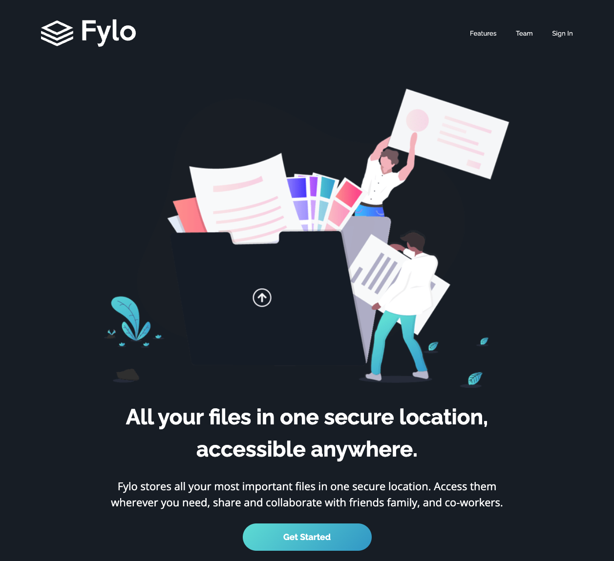

# Frontend Mentor - Fylo dark theme landing page solution

This is a solution to the [Fylo dark theme landing page challenge on Frontend Mentor](https://www.frontendmentor.io/challenges/fylo-dark-theme-landing-page-5ca5f2d21e82137ec91a50fd). Frontend Mentor challenges help you improve your coding skills by building realistic projects.

## Table of contents

- [Overview](#overview)
  - [The challenge](#the-challenge)
  - [Screenshot](#screenshot)
  - [Links](#links)
- [My process](#my-process)
  - [Built with](#built-with)
- [Author](#author)

**Note: Delete this note and update the table of contents based on what sections you keep.**

## Overview

### The challenge

Users should be able to:

- View the optimal layout for the site depending on their device's screen size
- See hover states for all interactive elements on the page

### Screenshot

### Links

- Solution URL: [link]([https://your-solution-url.com](https://www.frontendmentor.io/solutions/fylo-dark-landing-page-vanilla-js-scss-MIPF25AR4y))
- Live Site URL: [link](https://vicschbt.github.io/PERSO-fylo-dark-theme-landing-page/)

## My process

1. Build the structure in HTML
2. Styling each block in a mobile-first approach
3. Design the desktop behavior
4. Add the active states

### Built with

- Semantic HTML5 markup
- SCSS for styling
- Flexbox
- CSS Grid
- Mobile-first workflow

## Author

- Frontend Mentor - [@VicSchbt](https://www.frontendmentor.io/profile/VicSchbt)
- LinkedIn - [Victoire Schubert](www.linkedin.com/in/victoire-schubert)
